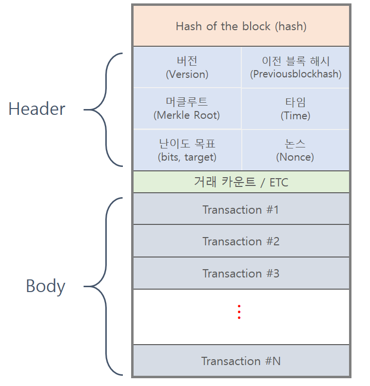

# 🌿 MerkleProof.circom – ZKP 기반 Merkle Tree 포함 증명

## 🎯 실습 목표

- Merkle Tree를 활용해 특정 데이터가 트리에 **포함되어 있는지 증명**하는 회로 설계
- 경량 클라이언트(light node)의 **데이터 무결성 검증 메커니즘**을 ZKP로 학습
- Poseidon 해시를 사용하여 회로 내에서 경로 재현

---

## 🧩 회로 구조 요약

- 입력:
  - `leaf`: 증명하려는 데이터의 해시
  - `pathElements[]`: 형제 노드들의 해시
  - `pathIndices[]`: 각 노드가 왼쪽(0)인지 오른쪽(1)인지
  - `root`: 검증 기준이 되는 루트 해시
- 출력:

  - `isIncluded`: 루트 해시와 계산된 해시가 일치하면 1, 아니면 0

- 핵심 로직:
  1. leaf → root 방향으로 sibling hash와 함께 Poseidon 해싱
  2. 최종 결과가 `root`와 동일한지 비교

---

## 🔐 Merkle Tree 개념 요약



| 요소 | 설명 |
| --------- | ----------------------------------------------------------------- |
| 효율성 | O(log n) 크기의 경로만으로 데이터 포함 여부 검증 |
| 무결성 | root만 변경되어도 전체 구조 변경 감지 가능 |
| 활용 사례 | 블록체인 트랜잭션 루트, zkRollup 상태 루트, ZKBridge 상태 증명 등 |

---

## 🔧 실행 명령어 요약

```bash
# [1] 회로 컴파일
circom ../circuits/MerkleProof.circom --r1cs --wasm --sym -o ../build

# [2] Trusted Setup
snarkjs powersoftau new bn128 12 pot12_0000.ptau
snarkjs powersoftau contribute pot12_0000.ptau pot12_0001.ptau --name="Junseung"
snarkjs powersoftau prepare phase2 pot12_0001.ptau pot12_prep.ptau
snarkjs groth16 setup MerkleProof.r1cs pot12_prep.ptau MerkleProof.zkey
snarkjs zkey export verificationkey MerkleProof.zkey verification_key.json

# [3] 증명 생성 및 검증
node ./MerkleProof_js/generate_witness.js ./MerkleProof_js/MerkleProof.wasm ../inputs/input_MerkleProof.json MerkleProof.wtns
snarkjs groth16 prove MerkleProof.zkey MerkleProof.wtns MerkleProof.proof MerkleProof.public.json
snarkjs groth16 verify verification_key.json MerkleProof.public.json MerkleProof.proof
```
